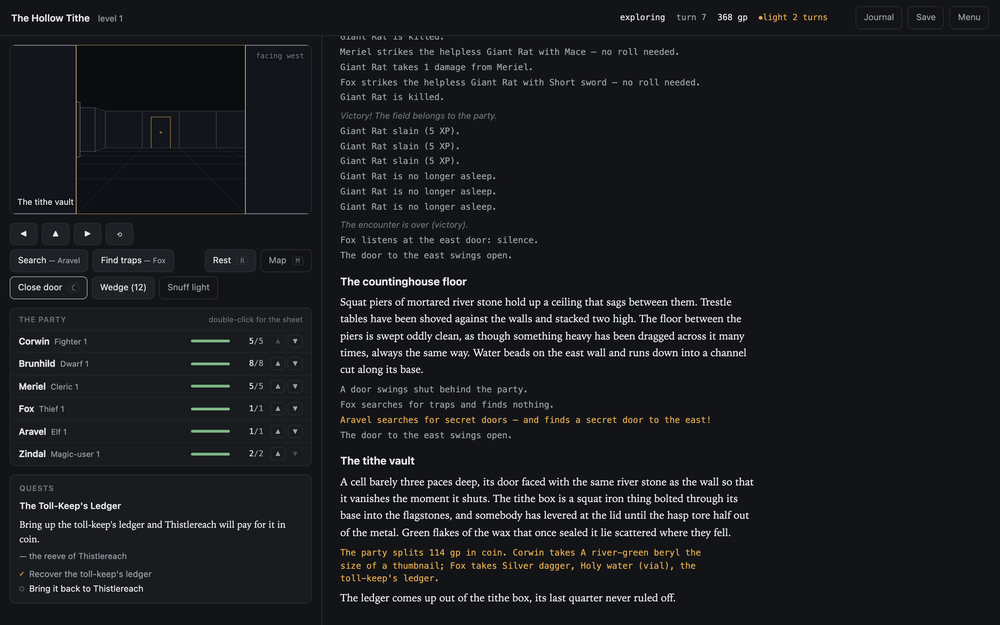
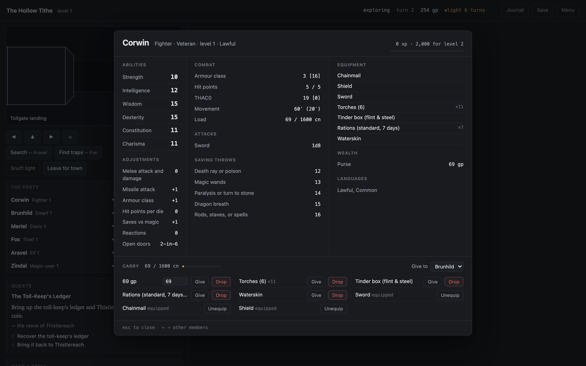
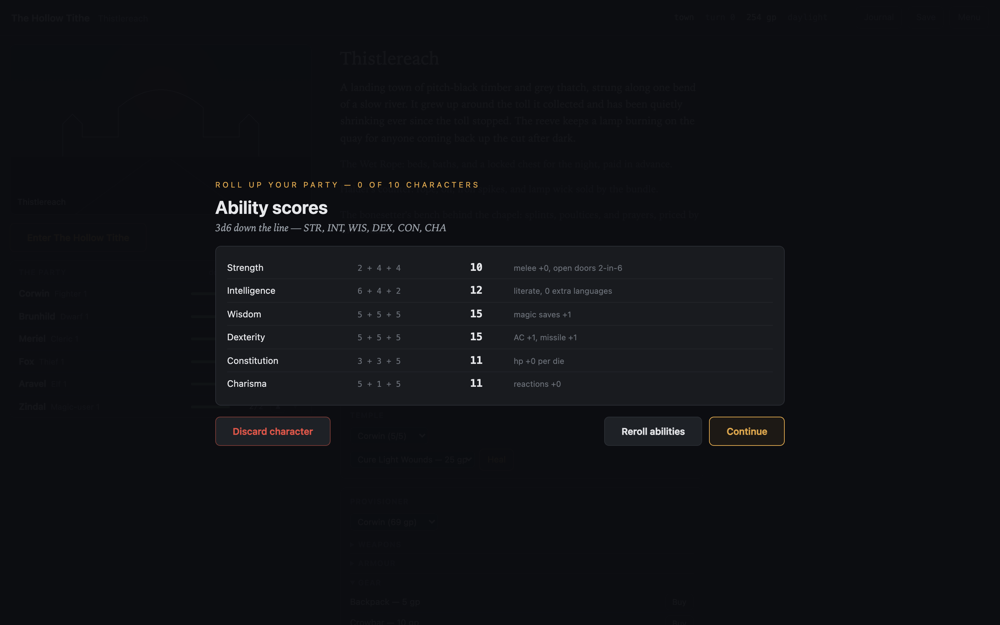
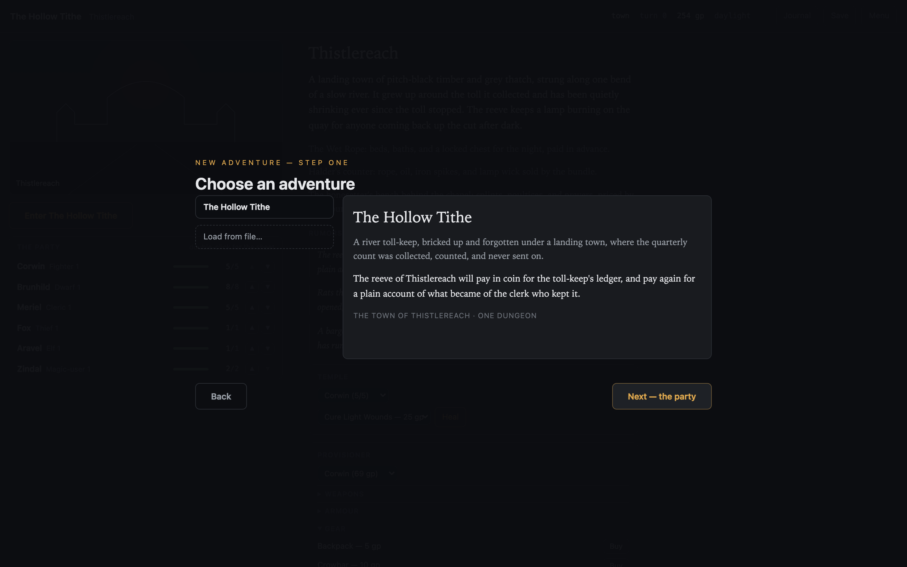
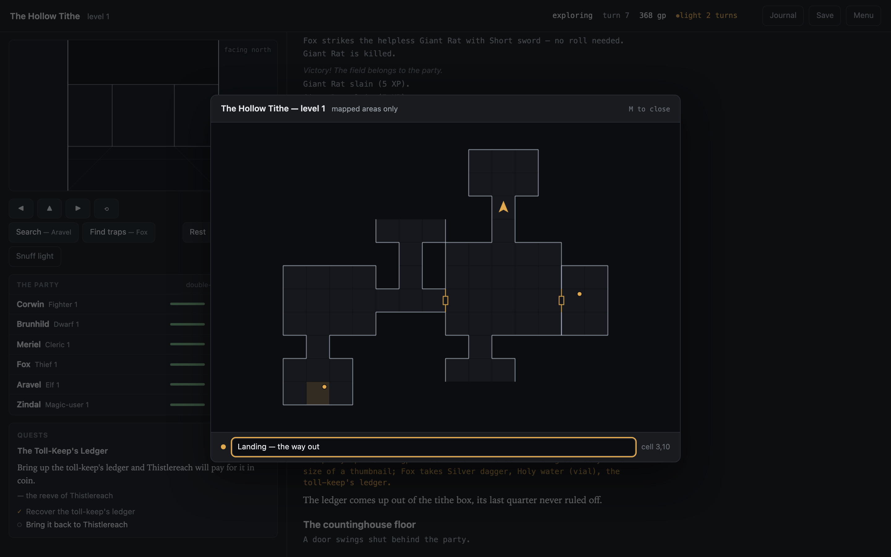

# osr-web

An old-school dungeon crawler in the browser. It's built on [osrlib](https://github.com/mmacy/osrlib-python), a rules engine for the classic 1981 B/X fantasy adventure game, and it plays any adventure document [osr-forge](https://github.com/mmacy/osr-forge) produces from a tabletop module PDF. *The Cold Vein* ships bundled: an abandoned silver mine above the hamlet of Cinderhope, two levels, twenty-one keyed areas. The library lists every other adventure document the server finds (see [The adventure library](#the-adventure-library)).

The engine owns every rule: movement, light, time, searching, treasure, encounters, reactions, the range-track battle state machine, morale, XP, and death. This app is a thin presentation layer: a FastAPI server that keeps the `GameSession` and its secrets server-side, and a dependency-free web client that renders only what a player is allowed to see.



## Run it

The rules engine lives in a sibling checkout. `pyproject.toml` declares `osrlib` as an editable path dependency on `../osrlib-python`, so `uv sync` fails with a path error until that clone exists:

```sh
git clone https://github.com/mmacy/osrlib-python ../osrlib-python
uv sync
uv run uvicorn server.app:app --port 8620
```

Then open <http://localhost:8620>.

You need Python 3.14 or newer. `uv sync` provisions a matching interpreter if your system doesn't have one. The engine is also [published on PyPI](https://pypi.org/project/osrlib/), but this repo deliberately tracks its tip: because the dependency is an editable path, the app always runs the revision you have checked out in `../osrlib-python`. If the server won't start after an engine update, sync both checkouts.

## How to play

You lead a classic party of six: fighter, dwarf, cleric, thief, elf, and magic-user. They're rolled fresh for each new game, 3d6 in order. Some parties are stronger than others. All of them are one bad round from the grave. This is B/X at level 1. Double-click any party row for that character's full record.



A new adventure is two steps from the title screen, and nothing is created until you commit. First browse the library. Reading about an adventure costs nothing. Then stage your party: the premade six (rename them, reroll them, bend the house rules), the veterans of any saved game, or your own party rolled a character at a time. Veterans keep their levels, spellbooks, gold, and standard gear from one module into the next; an adventure's own relics stay with that adventure, and the dead are still dead. Rolling your own is 3d6 down the line, a class your scores qualify for, hit points, starting gold, and a shopping trip, up to ten characters. **Begin the adventure** is the only button that starts a game.



- In town: buy torches and oil, pay the temple for healing, sell recovered treasure, rest, prepare spells, and enter any of the adventure's dungeons.
- Exploring: move with WASD or the arrow keys (forward, turn left/right, turn around). Light a torch (L) before you go far: striking the tinder box is a 2-in-6 roll per round, as the rules have it. Search for secret doors and traps, take treasure (T), rest a turn (R), and return to town from the entrance to bank your XP.
- Encounters: monsters react, and then you parley with them, wait them out, run (dropping treasure or food to distract pursuit), turn undead, or fight.
- Battle: declare one action per living member (attack, shoot, cast, close in, fall back, or hold), then resolve the round. The engine handles initiative, morale, and everything else.


An adventure's author can set the party a task, and the app never leaves that task hidden. From the moment the quest activates, a card shows it beside your play, in the left rail underground and on the town board above, and the journal (J, or the topbar button) keeps the record in the author's own words. The journal opens in town, in a fight, wherever you are. Complete every objective and you win the adventure: the victory screen counts the haul in a line, names the party, and puts the whole journal on the card to read. If the whole party dies first, you get a different ending screen. Both screens offer the same two ways on: **Roll a new party** into the same adventure, or **Return to the title**. The victory screen adds a third. **Save the party** writes a save from the ending screen itself, so a party that finished alive can be drafted as veterans into the next adventure.


Sessions live in server memory. To write one to disk, use **Save** or the menu (Esc). Saves survive server restarts. Each is named for where the party stands ("The Cold Vein — level 1, turn 60") unless you rename it. The title screen's **Continue** resumes the newest one in a click, **Load game** is where you browse, rename, and delete them, and a new adventure can draft any save's party as veterans. The menu's return, save, and load destroy nothing. **Abandon adventure** is the one red verb, and it deletes the session.

A save includes the adventure document it was made from, and nothing upgrades that document. That's deliberate: when you restore a save, you play the module you started in, not whatever the library holds now. The choice has one consequence worth knowing, though. A save taken from *The Cold Vein* before the mine had a quest in it still plays all the way to the bottom, and can never be won. Its party is still yours, so start a new adventure and draft them as veterans.

## The adventure library

Every adventure document osr-forge produces is playable. Each one is a JSON file stamped with its kind (`adventure`) and the schema and engine versions it was written against. The server scans, in order:

1. The bundled document (`content/adventure.json`, or `OSR_WEB_ADVENTURE=/path/to/adventure.json`).
2. The drop directory — `adventures/`, or `OSR_WEB_ADVENTURES_DIR=/path/to/dir` — where you can put an adventure JSON, an osr-forge output directory (anything holding an `adventure.json`), or a symlink to either.
3. `OSR_WEB_ADVENTURES`, a colon-separated list of extra files or directories, scanned the same way.

The server collapses duplicate documents (same bytes found twice) to one entry and gives each adventure a stable id slugged from its name. Whatever the scan finds is what the library offers, and you can browse it before any game exists. Each entry shows the adventure's description, hook, town, and dungeon count.



You can redirect every directory the server reads from, both the library's sources and the saves the title screen lists:

| Variable | Meaning | Default |
| --- | --- | --- |
| `OSR_WEB_ADVENTURE` | The bundled document (source 1). | `content/adventure.json` |
| `OSR_WEB_ADVENTURES_DIR` | *Replaces* the drop directory (source 2). | `adventures/` |
| `OSR_WEB_ADVENTURES` | *Appends* extra sources (source 3), colon-separated. | unset |
| `OSR_WEB_SAVES_DIR` | *Replaces* the directory the server writes saves to and lists them from. | `saves/` |

The two plural-looking names do different jobs: `OSR_WEB_ADVENTURES_DIR` swaps out the drop directory, while `OSR_WEB_ADVENTURES` leaves it in place and adds to the scan. Point `OSR_WEB_ADVENTURES_DIR` and `OSR_WEB_SAVES_DIR` at empty directories, as the tests do, to run with nothing local in the picker or the resume list.

## The storyteller (optional LLM narration)

With a local [Ollama](https://ollama.com) running, the referee gets a voice. Significant moments (entering a new area, an encounter erupting, a battle won or lost, a death, a trap, a rich haul) get a few sentences of prose in the transcript, written by a language model from player-visible facts only.

```sh
ollama pull llama3.2
OSR_WEB_NARRATOR=ollama OSR_WEB_NARRATOR_MODEL=llama3.2 uv run uvicorn server.app:app --port 8620
```

| Variable | Meaning | Default |
| --- | --- | --- |
| `OSR_WEB_NARRATOR` | Provider id (`ollama`). The **empty string** turns the feature off. | unset (falls through to `.env`) |
| `OSR_WEB_NARRATOR_MODEL` | Model name, like `llama3.2` or `qwen3:8b`. Required. | none |
| `OSR_WEB_NARRATOR_URL` | Provider base URL. | `http://localhost:11434` |
| `OSR_WEB_NARRATOR_TIMEOUT` | Per-passage generation timeout, seconds. | `30` |

**Unset is not off.** The server calls `load_dotenv()` on the repo-root `.env` at import, with
python-dotenv's default `override=False`: that fills in variables the process environment doesn't
already have, and leaves alone variables that are present but empty. So on a checkout whose `.env`
names a provider, `env -u OSR_WEB_NARRATOR` falls through to the `.env` value and turns narration
**on**. The reliable off switch from the shell is the empty string, `OSR_WEB_NARRATOR=`. It's present
in the environment, so dotenv leaves it alone, and the server reads the provider id with `.strip()`,
so empty means no provider. With no `.env` at all (a fresh clone, or CI) unset and empty behave the
same, which is why the asymmetry only ever bites people who have configured a narrator. When you
need to be sure, trust the state payload's `narration.enabled` rather than the environment.

You don't have to guess. The server prints one line at every launch, ahead of uvicorn's own, and
that line names `.env` when the provider came from the file.

```
INFO:     narration enabled: ollama, model llama3.2 (OSR_WEB_NARRATOR came from .env, not your environment; blank it to turn narration off)
INFO:     narration off: OSR_WEB_NARRATOR is empty
```

Nothing delays or alters the deterministic transcript. Passages arrive asynchronously as italic asides, and every failure (provider down, model missing, timeout) passes silently: the game plays exactly as it does without a narrator. The app never gives the model a fact the engine didn't state, and the only referee-only material in a prompt is the module text a passage replaces plus any private steering the adventure's author wrote for the moment.

Arriving somewhere new is the one moment the storyteller takes over. Instead of printing the module's raw location text, the narrator describes what the party perceives and keeps the author's secrets (hidden doors, unsprung traps, unfound treasure) unspoken. If no passage arrives in time, the client shows the raw module text.

## Layout

```
server/
  app.py       FastAPI wiring: per-session locks, the player-view wire contract,
               command execution, saves, and the cell-context enrichment
  content.py   adventure loading, the pregenerated party (tiered kits,
               ability-requirement retries), and party import from saves
  library.py   the adventure library: source scanning, dedupe, slug ids
  narrate.py   event → English transcript entries; entity ids resolve to names
               server-side, where the session lives
  llm.py       narrative providers (Ollama first): config, transport, health checks
  narration.py the narrative layer: beat detection, player-safe prompts, and the
               per-game worker that writes LLM passages into the transcript
static/
  index.html, style.css, app.js   the client: canvas wireframe viewport,
               automap, party roster, two-voice transcript, mode panels
content/
  adventure.json   the bundled adventure document, "The Cold Vein"
  README.md        what it is, what it exercises, and the route to its first fight
adventures/
  (gitignored)     your own forge adventures — files, directories, or symlinks
```

## Contributing

Read [AGENTS.md](AGENTS.md) before touching code. The name is a nod to coding agents, but it's the contributor guide for humans too: the architecture in one paragraph, the wire contract and why it must not weaken, and an index of the hard-won engine facts, each one a debugging session you won't have to spend, which live in [`.claude/rules/`](.claude/rules/) filed by the files they constrain. The endpoint reference and the screenshot-harness runbook live beside them in [`.claude/skills/`](.claude/skills/), which AGENTS.md links from the matching section. The engine has its own published documentation at <https://mmacy.github.io/osrlib-python/> (source in `../osrlib-python/docs/`). The concepts this app leans on hardest are `GameSession`, commands, events, and the player/referee visibility split.

Run the unit tests with:

```sh
uv run pytest
```

The suite covers the LLM narration layer, the one subsystem whose logic this repo owns outright. The game rules are osrlib's and are tested there. The rest of this app is wiring and rendering, verified end to end by driving the API against a seeded game (see "Run and verify" in AGENTS.md). Write tests in the same style for any new server logic that is more than a thin pass-through to the engine.

## Design notes

The game is old-school. The UI doesn't need to be. The chrome is a quiet, modern shell: neutral near-black, hairlines, system type, one torch-amber accent, red for danger only. The text of the game owns the screen, and the transcript uses two voices, a serif for the referee's prose and a mono for dice and mechanics. The first-person viewport is a small, honest wireframe in true one-point perspective. Wide rooms look wide, the client draws explored geometry in matte line work, and anything your light has never reached is darkness. The automap opens over the play view (M) and closes again. It draws every cell your light has shown you, not just the ones you've walked, and shows your own notes, pinned to mapped cells, stored in your browser and never on the server. The journal opens the same way (J), anywhere in the game, town included. It's the party's own record of the adventure, written as it happens. Double-click a party row for the character sheet, laid out the way the Moldvay set laid it out. The client plays a resolved round back one beat at a time, the log and the party rows keeping the same clock.



The client never sees the seed, monster HP, hidden geometry, or referee events. It renders `session.view(PLAYER)` and player-visible events only, per the engine's wire contract.

## Licensing

Three licenses, split by kind of material.

- **Code** is MIT ([`LICENSE`](LICENSE)): everything under `server/`, `static/`, `scripts/`, and `tests/`.
- **Creative content** is Creative Commons Attribution-NonCommercial 4.0 ([`LICENSE-CONTENT.md`](LICENSE-CONTENT.md)): *The Cold Vein*'s prose, names, map geometry, and quest text, and the same in the test fixtures and screenshots. It's original work written for this repository, derived from no published module, and [`content/README.md`](content/README.md) is its provenance note. Share it, run it, build on it. Selling it is the one thing reserved.
- **Game content** is Open Game Content under the Open Game License 1.0a ([`LICENSE-OGL.md`](LICENSE-OGL.md)): the B/X rules the app displays (spell text, monster and equipment statistics) and the mechanical elements adventure documents reference (monster and equipment ids, dice expressions, saving-throw categories, treasure types). That license file identifies exactly which portions those are and includes the complete Section 15 copyright notice.

If you host a public instance, the running server transmits Open Game Content to every browser it serves. Keep `LICENSE-OGL.md` with your deployment.

osr-web is an independent project, not affiliated with or endorsed by Necrotic Gnome. "Old-School Essentials" is a trademark of Necrotic Gnome. The name appears in the Section 15 notice and here only to identify the source of the Open Game Content, and no claim of compatibility is made.
